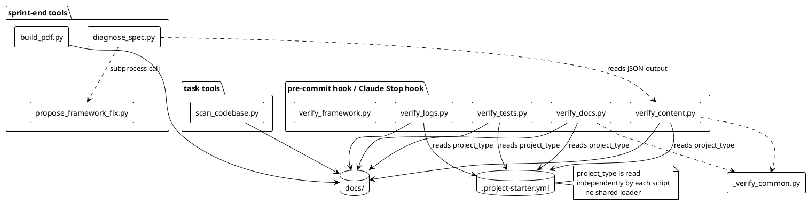
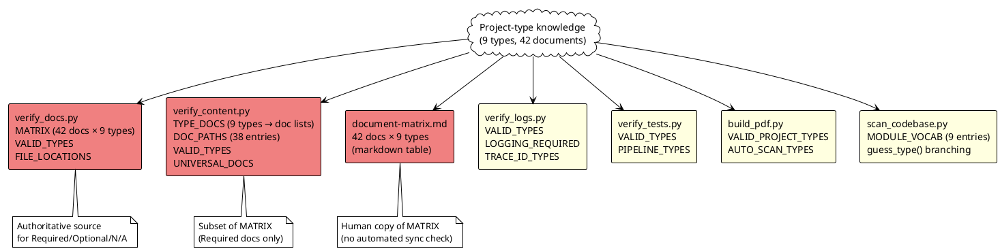

# Architecture Analysis — project_starter_v4

## Current Architecture

The framework consists of 12 Python scripts, one shared utility module, and 9 AI-facing guidance files. Scripts split into three functional groups:

**Verification layer** — run at every `git commit` (pre-commit hook) or sprint end:
- `verify_docs.py` — document presence and fill quality
- `verify_content.py` — spec content quality (per-doc checker functions)
- `verify_logs.py` — log documentation coverage
- `verify_tests.py` — test coverage and report currency
- `verify_framework.py` — internal consistency of the framework itself

**Support layer** — run at sprint end or on demand:
- `diagnose_spec.py` — classify verify output → project-level vs framework-level gaps
- `propose_framework_fix.py` — open PRs on project_starter_v4 for framework gaps
- `build_pdf.py` — render docs/ to PDF via PlantUML

**Task layer** — run during normal task work:
- `scan_codebase.py` — source tree → codebase-map.md

**Shared utility:**
- `_verify_common.py` — `_is_placeholder`, `_section_body` (53 lines; imported by verify_content.py, verify_docs.py)

---

## Dependency Graph — Hardcoded Project-Type Knowledge

Each node is a file. Red = encodes the primary document × type matrix. Yellow = encodes a subset of that knowledge independently.

---

## Coupling Problem Catalogue

### Problem 1 — VALID_TYPES declared in four separate scripts

The list of 9 project types is hardcoded independently in:

| File | Line | Declaration |
|---|---|---|
| `verify_docs.py` | 22–26 | `VALID_TYPES = ['web-app', 'cli-tool', ...]` |
| `verify_content.py` | 30–35 | `VALID_TYPES = ['web-app', 'cli-tool', ...]` |
| `verify_logs.py` | 30–34 | `VALID_TYPES = ['web-app', 'cli-tool', ...]` |
| `verify_tests.py` | 28–32 | `VALID_TYPES = ['web-app', 'cli-tool', ...]` |
| `scan_codebase.py` | 112–124 | `MODULE_VOCAB` dict keys (implicit type list) |
| `build_pdf.py` | ~200 | `VALID_PROJECT_TYPES` list |

**Adding a new project type requires 6 edits.** `verify_framework.py` Check 8 cross-validates `scan_codebase.py` vs `verify_docs.py` only — the other four scripts have no guard.

### Problem 2 — Document × type matrix encoded in three places

The mapping "which documents are Required / Optional / N/A for each type" lives in:

| File | Lines | Form | Guard |
|---|---|---|---|
| `verify_docs.py` | 32–80 | `MATRIX` dict (42 rows × 9-col R/O/N tuples) | Authoritative |
| `verify_content.py` | 75–94 | `TYPE_DOCS` dict (type → list of docs to content-check) | Checked by `verify_framework.py` Check 10 |
| `templates/init/document-matrix.md` | 10–52 | Markdown table (42 rows × 9 cols) | **No automated check** |

**Adding a new document requires 3 edits.** `document-matrix.md` can silently drift from `MATRIX`.

### Problem 3 — Document file paths encoded in two places

| File | Lines | Form |
|---|---|---|
| `verify_docs.py` | 80–133 | `FILE_LOCATIONS` dict (doc → folder name, e.g. `'architecture'`) |
| `verify_content.py` | 36–71 | `DOC_PATHS` dict (doc → relative path, e.g. `'architecture/database.md'`) |

**Moving a document requires 2 edits.** No cross-check exists between the two.

### Problem 4 — Per-type behavioural flags scattered across scripts

| Script | Constant | Per-type rule | Line |
|---|---|---|---|
| `verify_logs.py` | `LOGGING_REQUIRED` | Which types require a logging-spec.md | 36 |
| `verify_logs.py` | `TRACE_ID_TYPES` | Which types must propagate trace_id | 40 |
| `verify_tests.py` | `PIPELINE_TYPES` | Which types use pipeline-specific test checks | 33 |
| `verify_content.py` | `UNIVERSAL_DOCS` | 4 docs that apply to all types regardless | 72 |
| `scan_codebase.py` | `guess_type()` | Per-type module naming heuristics | 193–230 |

These flags cannot be validated against each other — if `data-pipeline` is added to `LOGGING_REQUIRED` in `verify_logs.py` but the corresponding flag is missing from `verify_content.py`'s `TYPE_DOCS`, no check catches the inconsistency.

### Problem 5 — AI startup cost: project type resolved by inference

When an AI agent starts a task, it must:
1. Read `AGENTS.md` (~190 lines) to learn the startup sequence
2. Read `docs/current-state.md` to find the current task
3. Infer which documents to load from the Quick filter guide in `templates/sprint-sync.md`

This inference step adds token cost on every task startup and produces inconsistent results across AI tools (Claude Code, Codex, Cursor, manual).

---

## Recommended Responsibility Boundaries (post-refactor)

| Concern | Current owner | Target owner |
|---|---|---|
| Valid type list | `VALID_TYPES` in 4 scripts | `document-registry.yaml` |
| Document → type mapping (R/O/N) | `MATRIX` in `verify_docs.py` | `document-registry.yaml` |
| Document → path mapping | `FILE_LOCATIONS` + `DOC_PATHS` | `document-registry.yaml` |
| Per-type behavioural flags | Scattered sets in 3 scripts | `document-registry.yaml` |
| Human-readable matrix | `document-matrix.md` (manual copy) | Generated from registry |
| Task startup context | AI inference from AGENTS.md rules | `build-context.py` output (`.ai/AI_CONTEXT.md`) |
