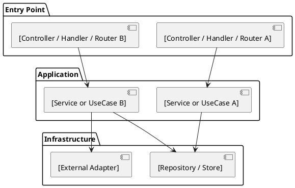

# architecture/backend.md

Purpose:
Describe backend structure — what stack is used, how it is layered, and how modules are organized.

Include:
- Stack
- Layering (use your actual layer names and count — do not assume any fixed pattern)
- Layer responsibilities
- Module pattern (file structure per feature)

Avoid:
- Full API endpoint list
- Feature requirements
- Business rules

---

## Stack

[List the runtime, framework, ORM/query layer, and database. e.g.:
  Node.js 22 / Express / Prisma / PostgreSQL
  Python 3.12 / FastAPI / SQLAlchemy / PostgreSQL
  Go 1.22 / Gin / sqlx / MySQL
  Java 21 / Spring Boot / JPA / PostgreSQL
  Ruby 3 / Rails / ActiveRecord / PostgreSQL]

---

## Layering

<!--
  Describe the actual layers in your architecture.
  Do not copy a template — use the names and count that reflect what the code actually does.

  Examples of different patterns:
    REST (3-layer):   Controller → Service → Repository
    CQRS:             Command Handler / Query Handler → Domain → Repository
    Clean/Hexagonal:  Controller → UseCase → Port → Adapter
    MVC (Rails-style): Router → Controller → Model
    Django:           View → Serializer → Model
    Serverless:       Function Handler → Service → DB Client
    Monolith (simple): Router → Handler → DB

  Fill in your actual layers below. Add or remove rows as needed.
-->

```
[Layer 1] → [Layer 2] → [Layer 3] → ...
```

| Layer | Responsibility |
|---|---|
| [Layer 1 name] | [What this layer does] |
| [Layer 2 name] | [What this layer does] |
| [Layer 3 name] | [What this layer does] |

---

## Module Pattern

<!--
  Describe how files are organized per feature/module.
  Show the actual folder and file naming convention used in this project.
  Do not use placeholder extension names — use the real ones (.ts, .py, .go, .rb, etc.)

  Examples:
    Node/Express:
      src/[module]/[module].controller.ts
      src/[module]/[module].service.ts
      src/[module]/[module].repository.ts

    FastAPI:
      app/[module]/router.py
      app/[module]/service.py
      app/[module]/models.py

    Go:
      internal/[module]/handler.go
      internal/[module]/usecase.go
      internal/[module]/repository.go

    Rails:
      app/controllers/[module]_controller.rb
      app/models/[module].rb
      app/services/[module]_service.rb
-->

```
[show actual file tree for one representative module]
```

---

## Component Structure

<!--
  Describes the backend layer dependency structure as a component diagram.
  Fill in based on the actual layers described in the Layering section above.
  Use the real layer names — not Controller/Service/Repository unless that is actually your pattern.
  Add or remove component blocks to match your actual number of layers.
  After writing: edit the ```plantuml block in the file, then run build_pdf.py to rebuild PDF
-->


