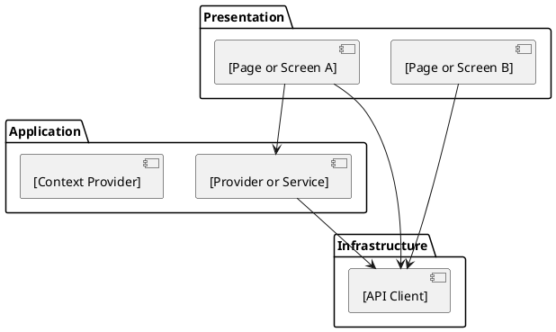

# architecture/frontend.md

Purpose:
Describe frontend structure — what stack is used, how pages and components are organized,
and how data fetching is handled.

Include:
- Stack
- Page / screen structure
- Component strategy
- Data fetching / state management strategy
- Shared UI standards

Avoid:
- Page-by-page requirements
- UI text
- Business workflow details

---

## Stack

[List the framework, language, styling approach, and data fetching library. e.g.:
  React 18 / TypeScript / Tailwind CSS / React Query
  Vue 3 / TypeScript / Pinia / Axios
  Next.js 14 / TypeScript / Tailwind CSS / SWR
  Svelte / TypeScript / TailwindCSS
  Flutter / Dart
  Swift / SwiftUI
  Android / Kotlin / Jetpack Compose
  Angular / TypeScript / RxJS]

---

## Page / Screen Structure

<!--
  Describe how pages or screens are organized in the project.
  Use the actual folder names and file extensions from the codebase.
  Do not copy a template — show the real structure.

  Examples:
    React (feature-based):
      src/pages/[feature]/[Feature]Page.tsx
      src/components/[feature]/[Feature]Form.tsx
      src/hooks/use[Feature].ts

    Next.js (app router):
      app/[feature]/page.tsx
      app/[feature]/[Feature]Form.tsx

    Vue:
      src/views/[Feature]View.vue
      src/components/[Feature]Form.vue
      src/stores/[feature]Store.ts

    Flutter:
      lib/features/[feature]/[feature]_screen.dart
      lib/features/[feature]/widgets/[feature]_form.dart

    iOS / SwiftUI:
      [Feature]/[Feature]View.swift
      [Feature]/[Feature]ViewModel.swift
-->

```
[show actual folder structure for one representative feature]
```

---

## Component Strategy

<!--
  Describe how UI is split into components / widgets / views.
  Use the naming convention actually used in this project.

  Examples:
    Page → Section → Component (React)
    View → ViewModel → Component (MVVM)
    Screen → Widget → Widget (Flutter)
    View → Partial (Rails / server-rendered)
-->

[Describe component split principles]

---

## Data Fetching / State Management

<!--
  Describe how data is fetched and how state is managed.
  Use the actual library or pattern from this project.

  Examples:
    React Query / TanStack Query — server state, caching, invalidation
    SWR — stale-while-revalidate data fetching
    Redux Toolkit — global client state
    Pinia / Vuex — Vue state management
    Riverpod / Provider — Flutter state management
    MobX — observable state
    Plain fetch / axios with useState — no external state library
    Server-rendered — no client state management (Rails, Django, Laravel, etc.)
-->

[Describe the data fetching and state management approach used in this project]

---

## Shared UI Standards

[Describe shared components, design system, icon library, form library, etc.]

---

## Component Structure

<!--
  Describes the frontend layer dependency structure as a component diagram.
  Fill in based on the actual layers described above.
  Use the real layer names — not Page/Hook/API Client unless that is actually your pattern.
  Add or remove component blocks to match your actual number of layers.
  Remove this section entirely if the project has no significant frontend
  (e.g. pure API, CLI tool, or server-rendered with no JS framework).
  After writing: edit the ```plantuml block in the file, then run build_pdf.py to rebuild PDF
-->


