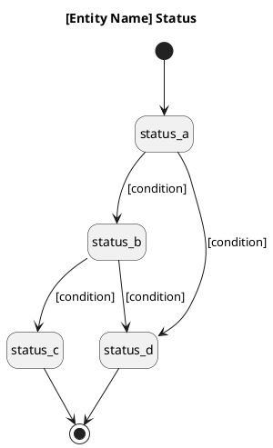

# Data Model

<!--
  Describes the database design at the implementation level.
  Corresponds to the technical implementation layer of business-objects.md.

  Default format below assumes a relational SQL database.
  If your project uses a different data store, adapt the format:

    Document DB (MongoDB, Firestore):
      Replace the field table with a JSON schema or key listing.
      Replace "Indexes" with collection indexes.
      Replace "Migration Plan" with schema evolution notes (or omit if not applicable).
      State machines still apply — describe them as a field with allowed values.

    Key-value store (Redis, DynamoDB):
      Replace the field table with key structure and value schema.
      Replace "Indexes" with secondary index or GSI definitions.
      Omit "Migration Plan" or describe key namespace changes instead.

    Graph DB (Neo4j):
      Replace entity sections with Node type and Edge type sections.
      Describe properties per node/edge type.

  Keep whatever structure best describes your actual data store.
  After writing, run: Edit the ```plantuml block in the file, then rebuild PDF
-->

---

## [Entity / Collection / Node Name] (`[table_name / collection_name]`)

**Purpose:** [What this entity stores]

<!--
  For SQL: list fields with type, constraint, and description.
  For document DB: list top-level keys with type and description.
  For key-value: describe key format and value schema.
  Adapt column headers to match your data store's concepts.
-->

| Field | Type | Constraint | Description |
|---|---|---|---|
| `id` | [e.g., UUID / ObjectId / string] | PK, NOT NULL | Primary key |
| `[field]` | [type] | [constraint] | [Description] |
| `[fk_field]_id` | [type] | FK → `[table].id`, NOT NULL | [Description] |
| `status` | [e.g., ENUM / string] | NOT NULL | See state machine below |
| `created_at` | [e.g., TIMESTAMPTZ / Date / number] | NOT NULL | Creation timestamp |
| `updated_at` | [e.g., TIMESTAMPTZ / Date / number] | NOT NULL | Last updated timestamp |
| `deleted_at` | [e.g., TIMESTAMPTZ / Date / number] | nullable | Soft delete — omit if not used |

**Indexes:**

<!--
  For SQL: list B-tree / GIN / GiST indexes.
  For document DB: list collection indexes.
  For DynamoDB: list GSI and LSI definitions.
  Omit this section if there are no indexes beyond the primary key.
-->

| Index name | Field(s) | Purpose |
|---|---|---|
| `idx_[table]_[field]` | `[field]` | [Which query this serves] |

**State Machine:**

<!--
  Include this section only if this entity has a meaningful status lifecycle.
  For SQL: corresponds to an ENUM or string field named `status`.
  For document DB: corresponds to a string field with allowed values.
  Omit this section if there is no status lifecycle.

  IMPORTANT: State transitions are defined in docs/business/[object-name]-object.md —
  that file is the canonical source of truth. Do NOT redefine transitions here.
  This section should only:
    1. List the ENUM / allowed string values
    2. Map each value to its business-level state name from the object file
  If the transitions listed here differ from the object file, update this section to match.
-->

```
[status_a] → [status_b] → [status_c]
                 ↓
             [status_d]
```

| Status | Can transition to |
|---|---|
| `[status_a]` | `[status_b]`, `[status_d]` |
| `[status_b]` | `[status_c]`, `[status_d]` |
| `[status_c]` | — |
| `[status_d]` | — |



---

## [Entity / Collection / Node Name] (`[table_name / collection_name]`)

**Purpose:** [Description]

| Field | Type | Constraint | Description |
|---|---|---|---|
| `id` | [type] | PK, NOT NULL | Primary key |
| `[field]` | [type] | [constraint] | [Description] |
| `created_at` | [type] | NOT NULL | |
| `updated_at` | [type] | NOT NULL | |

**Indexes:**

| Index name | Field(s) | Purpose |
|---|---|---|
| `idx_[table]_[field]` | `[field]` | [Which query this serves] |

---

## Migration Plan

<!--
  For SQL: list migration files in execution order.
  For document DB: describe schema evolution steps (index additions, field renames, backfills).
  For key-value / graph DB: describe any data reshaping or key namespace changes.
  Omit this section if the data store has no migration concept.
-->

| Order | File / Step | Operation | Reversible |
|---|---|---|---|
| 1 | `[timestamp]_create_[table]` | CREATE TABLE / create collection | ✅ |
| 2 | `[timestamp]_add_index_[table]` | CREATE INDEX | ✅ |
| 3 | `[timestamp]_modify_[col]_[table]` | ALTER TABLE / backfill field | ⚠️ Verify data first |

---

## Query Patterns

<!--
  List the most important or performance-sensitive read patterns.
  For SQL: show the WHERE condition and which index is used.
  For document DB: show the filter and which index is used.
  For DynamoDB: show the access pattern and which key / GSI is used.
  Omit this section if there are no notable query patterns.
-->

| Query | Condition | Index used |
|---|---|---|
| [e.g., List by owner] | `owner_id = ?` AND `deleted_at IS NULL` | `idx_[table]_owner_id` |
| [e.g., Filter by status] | `status = ?` | `idx_[table]_status` |
