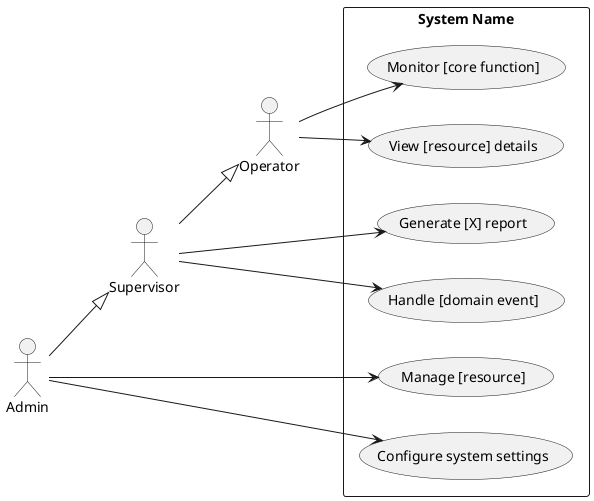

# Permissions

<!--
  Describes roles, permission definitions, and access control for every API endpoint.
  Corresponds to every endpoint in api-contract.md.

  Access control model: fill in the actual model used in this project.
  Common models:
    RBAC  — Role-Based Access Control (roles assigned to users, permissions assigned to roles)
    ABAC  — Attribute-Based Access Control (permissions based on user/resource attributes)
    ACL   — Access Control List (per-resource permission entries)
    Ownership-only — no roles, each user can only access their own resources

  The Role Definitions, Permission Definitions, and RBAC Matrix sections below
  assume RBAC. If the project uses a different model, replace those sections
  with whatever structure best describes the actual access control design.

  After writing, run: Edit the ```plantuml block in the file, then rebuild PDF
-->

**Access Control Model:** [RBAC / ABAC / ACL / Ownership-only / other]

---

## Role Definitions

<!--
  List the actual roles in this project.
  The three roles below (GUEST / USER / ADMIN) are examples — replace with real role names.
  Inherits from is optional — omit the column if roles do not inherit from each other.
-->

| Role | Description | Inherits from |
|---|---|---|
| `[ROLE_NAME]` | [Who this role represents and what they can access] | [— or parent role] |
| `[ROLE_NAME]` | [Description] | [— or parent role] |

---

## Permission Definitions

| Permission | Description |
|---|---|
| `[resource]:read` | Read [resource] |
| `[resource]:create` | Create [resource] |
| `[resource]:update` | Update own [resource] |
| `[resource]:update:any` | Update any [resource] |
| `[resource]:delete` | Delete own [resource] |
| `[resource]:delete:any` | Delete any [resource] |

---

## RBAC Matrix

<!--
  ✅ Allowed
  ❌ Denied
  🔶 Conditionally allowed (see notes below)
-->

| Permission | ROLE_GUEST | ROLE_USER | ROLE_ADMIN |
|---|---|---|---|
| `[resource]:read` | ✅ | ✅ | ✅ |
| `[resource]:create` | ❌ | ✅ | ✅ |
| `[resource]:update` | ❌ | 🔶 | ✅ |
| `[resource]:update:any` | ❌ | ❌ | ✅ |
| `[resource]:delete` | ❌ | 🔶 | ✅ |
| `[resource]:delete:any` | ❌ | ❌ | ✅ |

**🔶 Conditions:**
* `[resource]:update` — `ROLE_USER` may only update resources where `owner_id = current_user.id`
* `[resource]:delete` — `ROLE_USER` may only delete resources where `owner_id = current_user.id`

---

## API Endpoint Access

<!--
  Cross-check required before finalising this table:
  For every role listed as a "Responsible role" or "Owner" in any docs/business/*-process.md,
  verify that role has at least the minimum endpoint access needed to perform its responsibility.

  A role that is assigned a business responsibility but denied the required endpoint
  is a logical contradiction — it must be resolved here, not left to the implementer to guess.

  Steps:
  1. Read every *-process.md file
  2. Note every (role, action) pair in the Process Steps and Responsible role columns
  3. Confirm each role can reach the endpoint that supports that action
  4. If a gap exists, either grant access or explicitly document why the role uses
     a different path (e.g., via a supervisor, via a separate tool)

  Source column — mandatory distinction:
  Every row must specify whether access is a Hardcoded constraint or a Seeded default:
    - Hardcoded: enforced in code (middleware with a fixed role list, route guard with
      roles=[...]). Cannot be changed without a deployment. Document as a definitive rule
      in business-rules.md if it encodes a business policy.
    - Seeded default: the starting state in the database/role table. Can be changed at
      runtime by an admin (e.g. via a Role Management page). Document as "(Default)" —
      do NOT write it as a permanent rule in business-rules.md, since it can change
      without a code deploy.

  If this project has a Role Management feature, most role-permission rows are seeded
  defaults, not hardcoded constraints. Mixing them up causes contradictions between
  business-process.md (what a role should be able to do) and this table (what the role
  can access right now, which may just be today's default).
-->

| Method | Path | Required permission | Minimum role | Source | Extra condition |
|---|---|---|---|---|---|
| `POST` | `/[resource]` | `[resource]:create` | `ROLE_USER` | [Hardcoded / Seeded default] | — |
| `GET` | `/[resource]` | `[resource]:read` | `ROLE_GUEST` | [Hardcoded / Seeded default] | — |
| `GET` | `/[resource]/:id` | `[resource]:read` | `ROLE_GUEST` | [Hardcoded / Seeded default] | — |
| `PATCH` | `/[resource]/:id` | `[resource]:update` | `ROLE_USER` | [Hardcoded / Seeded default] | Own resource only |
| `DELETE` | `/[resource]/:id` | `[resource]:delete` | `ROLE_USER` | [Hardcoded / Seeded default] | Own resource only |

---

## Enforcement Layers

| Layer | Responsibility |
|---|---|
| API Gateway | JWT validation, role extraction |
| Middleware | Role-permission check, reject unauthorized (403) |
| Service Layer | Ownership check — `owner_id = current_user.id` |

---

## Edge Cases

| Edge Case | Design | Response |
|---|---|---|
| Unauthenticated access to protected resource | API Gateway JWT check fails | `401 AUTH_TOKEN_MISSING` |
| Low-privilege role attempts high-privilege action | Middleware role check | `403 AUTH_PERMISSION_DENIED` |
| User accesses another user's resource | Service Layer ownership check | `403 AUTH_RESOURCE_NOT_OWNED` |
| Expired token | API Gateway JWT check fails | `401 AUTH_TOKEN_EXPIRED` |

---

## Use Case Diagram

<!--
  System-level view — list ALL roles and ALL major functions across all modules.
  Not per resource, not per module — the whole system in one diagram.
  After writing, run: Edit the ```plantuml block in the file, then rebuild PDF
-->


