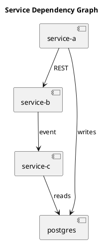

# Service Catalog

<!--
  For: Microservices projects
  Purpose: Single source of truth for every service in the system — what it does,
           who owns it, how to reach it, and what it depends on.
  Update when: A service is added, removed, or renamed; ownership changes;
               port or base URL changes; major dependency changes.
-->

## Services

| Service | Type | Owner | Port | Base URL | Status |
|---|---|---|---|---|---|
| [service-name] | [API / Worker / Gateway / Frontend] | [team or person] | [port] | [http://service-name:port] | Active / Deprecated |

---

## Service Details

Repeat this block for each service.

---

### [service-name]

**Type:** API service / Background worker / API gateway / Frontend / Scheduled job

**Owner:** [Team or person responsible for this service]

**Repository:** [Link or path to service repo]

**Purpose:** [One to two sentences — what business capability this service provides]

#### Runtime

| Property | Value |
|---|---|
| Language / Framework | [e.g., Node.js / Express, Python / FastAPI, Go / Chi] |
| Port | [e.g., 3001] |
| Base URL (local) | `http://service-name:3001` |
| Base URL (production) | `https://service-name.internal` |
| Health endpoint | `GET /health` |
| Docs endpoint | `GET /docs` or `GET /swagger` (if applicable) |

#### Dependencies

Services this service calls:

| Depends on | Protocol | Purpose |
|---|---|---|
| [other-service] | REST / gRPC / Event | [Why — what data or action it needs] |
| [database-name] | PostgreSQL / Redis / etc. | [What it stores there] |

Services that call this service:

| Called by | Protocol | For what |
|---|---|---|
| [other-service] | REST / gRPC / Event | [What they request] |

#### Events

Events this service **produces:**

| Event name | Topic / Queue | Schema |
|---|---|---|
| [EventName] | [topic-name] | [Reference to service-contract.md or schema file] |

Events this service **consumes:**

| Event name | Topic / Queue | Produced by |
|---|---|---|
| [EventName] | [topic-name] | [other-service] |

#### Key environment variables

| Variable | Description |
|---|---|
| `DATABASE_URL` | Connection string |
| `[OTHER_SERVICE]_URL` | Base URL for calling other-service |

---

## Dependency Graph

---

## Deprecated Services

| Service | Deprecated | Replacement | Shutdown date |
|---|---|---|---|
| [old-service] | YYYY-MM-DD | [new-service] | YYYY-MM-DD |
